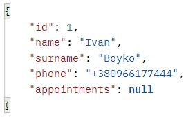

# Doctor-Appointment
Rest application to book a doctor's appointment.
## Table of Contents
* [General info](#general-info)
* [Setup](#setup)
* [Api](#api)
## General info
This project is allows doctors to generate their schedule for three days ahead avoiding weekends and generate appointments from 8am till 4pm per 30 minutes

###### <div align="center">Diagram of the database</div>
* Each doctor aside from his name and phone number has his spetialization and schedules.
* One schedule has it's date and lots of appointments from 8am to 4pm.
* One appointment has it's start and end time, status which could be either `AVAILABLE` or `RESERVED` and its relation to the person.
* Whereas person could reserve some appointments and as a result it's status become `RESERVED`
## Setup
1. Open the project in your Intellij Idea.
2. Add Java SDK 17 in Project Structure.
3. Install PostgreSQL if you don't have it or use Docker by using this command in terminal:
 ```
 $cd ../Doctors-Appointment
 $ docker-compose -f .\docker-compose.yaml up
 ```
4. Configure your datasource properties to create a connection:
   + Host: localhost
   + Port: 5432
   + Password and Login are: postgres 
   + This information could be found in [application.yaml](https://github.com/kreker1207/Doctor-Appointment/blob/master/src/main/resources/application.properties).
5. Run the project.
## Api
### Doctor's API:
#### GET Mapping:
 * `localhost:8080/v1/doctor` - this request returns all doctors from database
 * `localhost:8080/v1/doctor/{id}` - this request returns specified doctor by id as a path variable
#### POST Mapping:
* `localhost:8080/v1/doctor` - this request saves doctor from request body and returns saved entity
#### DELETE Mapping:
* `localhost:8080/v1/doctor/{id}` -ths request deletes doctor by id in a path variable
#### PUT Mapping:
* `localhost:8080/v1/doctor/{id}` - this requests updates doctor by set fields in a request body and doctor's id in a path 
##### <div align="center"> </div>
###### <div align="center">Doctor's Json template</div>
### Person's API:
#### GET Mapping:
 * `localhost:8080/v1/person` - this request returns all people from database
 * `localhost:8080/v1/person/{id}` - this request returns specified person by id as a path variable
#### POST Mapping:
* `localhost:8080/v1/person` - this request saves person from request body and returns saved entity
#### DELETE Mapping:
* `localhost:8080/v1/person/{id}` -ths request deletes person by id in a path variable
#### PUT Mapping:
* `localhost:8080/v1/person/{id}` - this requests updates person by set fields in a request body and doctor's id in a path 
##### <div align="center"> </div>
###### <div align="center">Person's Json template</div>

### Appointment's API:
#### GET Mapping:
 * `localhost:8080/v1/appointment` - this request returns all appointment from database
 * `localhost:8080/v1/appointment/{id}` - this request returns specified appointment by id as a path variable
#### POST Mapping:
* `localhost:8080/v1/appointment` - this request saves appointment from request body and returns saved entity
#### DELETE Mapping:
* `localhost:8080/v1/appointment/{id}` -ths request deletes appointment by id in a path variable
#### PUT Mapping:
* `localhost:8080/v1/appointment/{id}` - this requests updates appointment by set fields in a request body and doctor's id in a path 
* `localhost:8080/v1/appointment/reserve/{id}` - this request presenting one of the main ideas of this application to reserve appointment by sending phone number as a `String` in request body and id of appointment as a path variable 
##### <div align="center"> </div>
###### <div align="center">Appointment's Json template</div>
### Schedule's API:
#### GET Mapping:
 * `localhost:8080/v1/schedule` - this request returns all schedules from database
 * `localhost:8080/v1/schedule/{id}` - this request returns specified schedule by id as a path variable
#### POST Mapping:
* `localhost:8080/v1/schedule` - this request saves schedule from request body and returns saved entity
* `localhost:8080/v1/schedule/generate/{id}` - this request implementing the main feature of this API to generate schedule for 3 days avoid weekends and creating appointments from 8am to 4pm by sending doctor's id as a path variable
* `localhost:8080/v1/schedule/generate/test/{id}` - this request needed only for manual testing generating of schedules by sending id of doctor as a path variable and any date in request body 
#### DELETE Mapping:
* `localhost:8080/v1/schedule/{id}` -ths request deletes schedule by id in a path variable
#### PUT Mapping:
* `localhost:8080/v1/schedule/{id}` - this requests updates schedule by set fields in a request body and doctor's id in a path 
##### <div align="center"> </div>
###### <div align="center">Schedule's Json template</div>
